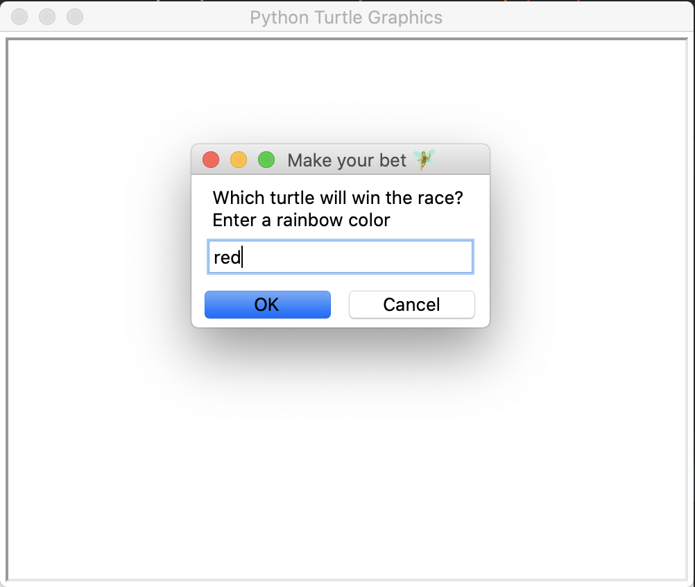
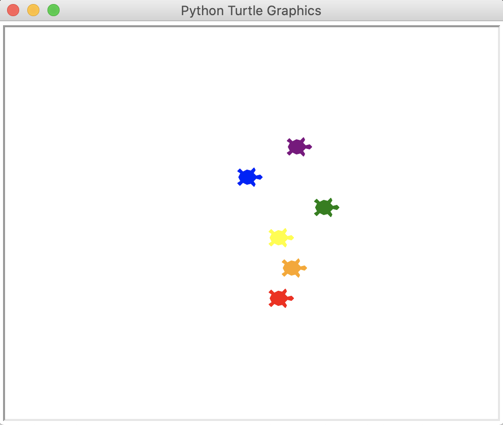

# turtles_race
Race between 6 turtles, on every calculation's round the number of path of each turtle is randomly generated. 

Inform the color of the turtle you want to big on. 

🐢Turtle's colors availables are rainbow's colors🌈: 
- red
- orange
- yellow
- green
- blue
- purple 

Encourage your turtle !

Can be test and run at the following repl: 
https://repl.it/@ElisePitel/turtlesrace#main.py

### Improves to do in the future: 
- Insert replay button
- 🐛 : sometimes the winner turtle can have its head within the right wall
